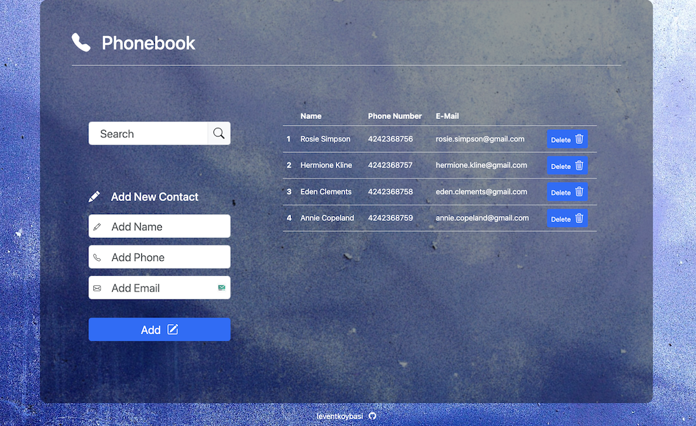

# Phonebook Application

[](https://goit-react-hw-03-levent.vercel.app/)

## Description

The Phonebook Application is a React-based project built with Vite. It allows users to manage their contacts by adding, searching, and deleting entries. The application also supports data persistence using localStorage, ensuring your contacts remain available after a page refresh.

## Features

- Add new contacts with name and phone number.
- Search contacts by name with a case-insensitive filter.
- Delete contacts with a single click.
- Form validation powered by Yup.
- Data persistence using localStorage.

## Technologies Used

- **React** for building the user interface.
- **Vite** for fast development and build.
- **Formik** for creating and managing forms.
- **Yup** for schema validation.
- **Nanoid** for generating unique IDs.
- **Bootstrap** and **Bootstrap Icons** for styling.
- **Modern Normalize** for consistent cross-browser styles.

## File Structure

Each component is modularized, with JSX and CSS files stored in separate folders under the `src/components` directory. CSS files are managed using CSS Modules for scoped styling.

## Installation and Setup

1. Clone the repository:

   ```bash
   git clone https://github.com/leventkoybasi/goit-react-hw-03.git
   cd goit-react-hw-03
   ```

2. Install dependencies:

   ```bash
   npm install
   ```

3. Start the development server:

   ```bash
   npm run dev
   ```

4. Build for production:

   ```bash
   npm run build
   ```

5. Deploy on Vercel or any preferred hosting platform.

## Live Demo

Visit the deployed application here: [Phonebook Application](https://goit-react-hw-03-levent.vercel.app/)
